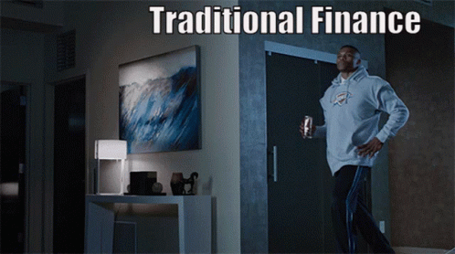

# ToyDApp
This is my pet project to demonstrate solidity and react js skills
## About

This is a (partly) decentralized application for exchanging ERC20 tokens for ETH on the Ethereum Goerli testnet. For mint USDV contact me on social media. I disabled this feature to prevent users from emptying ETH in the storage contract.
